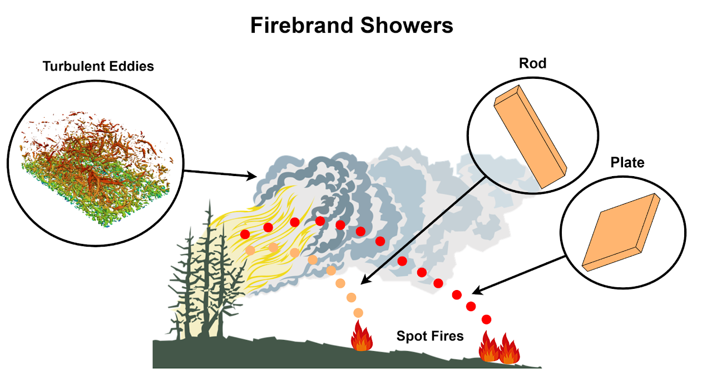

# Overview
This project is about the numerical modeling of firebrand showers in wildfire simulations.

- **Problem**: Firebrands can spread wildfire through the ignition of spot fires, yet there is a gap in knowledge on where they will land due to turbulent wind 

- **Solution**: Model high-resolution turbulent boundary layers at various turbulence intensities, and release firebrands in those domains to study the effect of small-scale turbulence 

- **Results**: Novel implementation of firebrand transport model coupled with wildfire simulation WRF-SFIRE for comparison between large-scale and small-scale transport

# Problem
- Firebrand showers are the fastest and most complex form of wildfire spread, by generating spot fires in random locations. 

- There is a gap in knowledge on where firebrands land due to turbulent wind. 

- There is no existing coupled firebrand-wildfire simulation with complex firebrand shapes.

## Firebrand shapes
Experimental data has shown that firebrands are made of 3 basic shapes: compact, plate, and rod. Studies have shown that particles of different shapes have different flight trajectories. And in the wildfire research community, these difference have not yet been fully explored.

## Small & Large-scale Turbulence
Modern wildfire simulations use large grid sizes in their computational meshes (around 250-300 m). This leads to only large-scale turbulence seen in the flow. Understanding the transport of plate and rod shapes in small-scale turbulence is crucial for understanding large-scale transport in wildfire simulations. With this knowledge, researchers will better understand how spot fires are generated.

# Turbulent Boundary Layers

### Setup
| Parameters | Mesh Resolution | Simulation Cases |
|---|---|---|
| U = 2.23 m/s  | ∆x = 0.025 m | 4% turbulence intensity |
| Re = 284,000  | ∆y = 0.025 m | 7% turbulence intensity |
| L = 2 m       | ∆z = 0.025 m |
| 𝓥 = 1.568E-5 | 

### Validation
Velocity profile of turbulent boundary layer simulations was validated with experimental data from Tohidi 2016. Power spectral density of turbulent boundary layer simulations validated with Kolomorgov -5/3 Spectrum to show a fully developed flow.

### Results
Q-Criterion
Iso-surfaces of the vortices in the 4% turbulence intensity simulation case

# Firebrand Transport Simulations

## Small-scale Transport
A series of 32 tests were conducted in the high-resolution turbulent boundary layer simulations in uniform and turbulent velocity fields. Plates and rods were released at 4 different heights

<iframe width="560" height="315" src="https://www.youtube.com/embed/0_YlRZiG-ZM?si=HC3_auktdFZstQNZ" title="YouTube video player" frameborder="0" allow="accelerometer; autoplay; clipboard-write; encrypted-media; gyroscope; picture-in-picture; web-share" allowfullscreen></iframe>